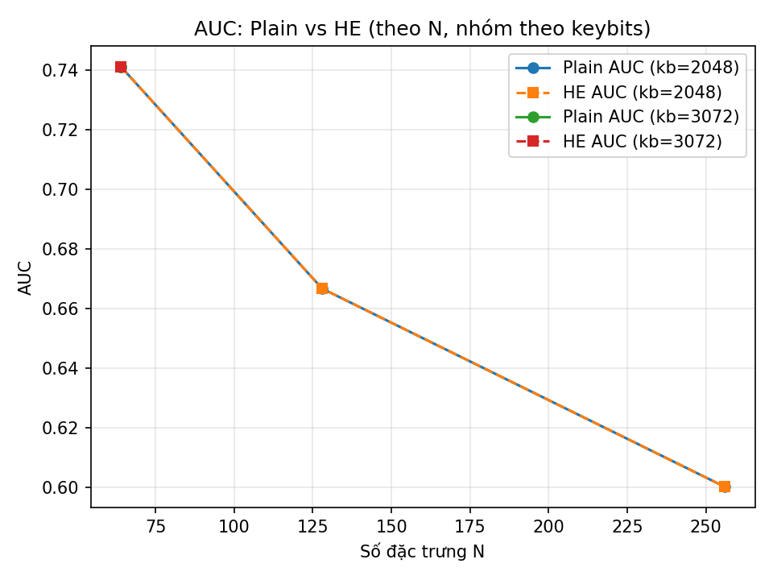
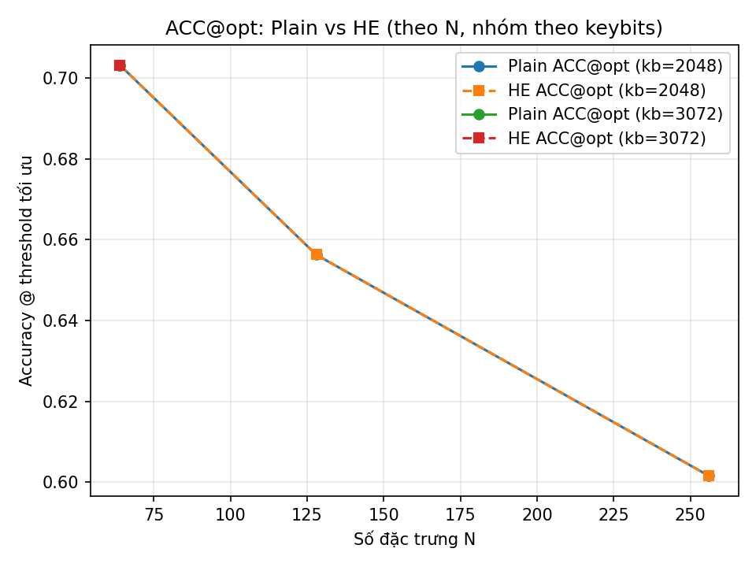
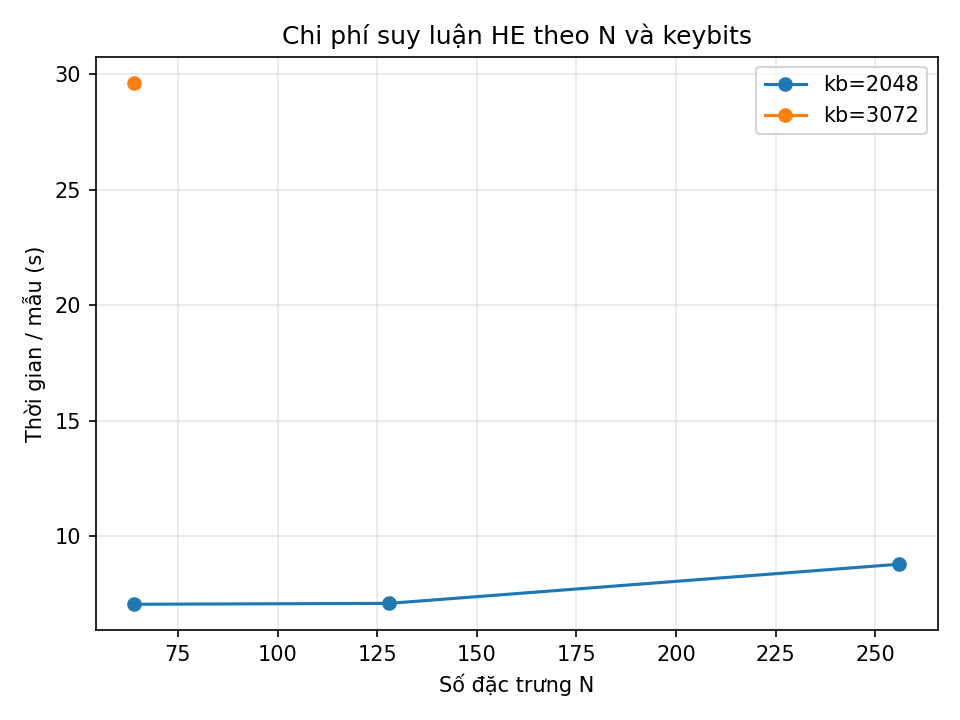

# 🧠 Secure Inference on BCI Data with Paillier Homomorphic Encryption

## 📌 Introduction
This project implements a **Brain-Computer Interface (BCI)** pipeline using EEG data from the [BigP3BCI dataset on PhysioNet](https://physionet.org/content/bigp3bci/1.0.0/).  
The goal is to train models for P300 classification and perform **secure inference** using Paillier Homomorphic Encryption (HE), ensuring EEG data privacy during computation.

---

## 📂 Project Structure
```
project/
│── inputs/                # Extracted EEG features
│   ├── SE001_timewin64/   # Time-window features
│   └── SE001_xdawn/       # xDAWN features
│── runs/                  # Model training outputs
│   ├── timewin64_cv/
│   └── xdawn_cv/
│── artifacts/             # Results & visualizations
│   ├── *.csv, *.md        # Tabular results
│   ├── *.png              # Figures
│   └── *.joblib           # Trained models
│── make_xdawn_features.py # Feature extraction (xDAWN)
│── save_features64.py     # Feature extraction (time-window)
│── train_eval_models.py   # Model training & selection
│── he_infer_paillier_artifacts.py # Secure inference with Paillier HE
│── demo_infer.py          # Demo comparison plaintext vs HE
│── run_he_suite.sh        # Run full pipeline
│── plot_result.py         # Generate result plots
└── README.md
```

---

## 📊 Dataset
- **Source**: [PhysioNet BigP3BCI](https://physionet.org/content/bigp3bci/1.0.0/)  
- **Description**: EEG data collected from BCI P300 speller experiments, across multiple sessions (A, B, C).  
- **Preprocessing**:  
  - Band-pass filter (0.1–15Hz) and 50Hz noise removal.  
  - Data normalization and epoch segmentation.  
  - Feature extraction methods:
    - **Time-window mean** (64 channels × temporal windows).  
    - **xDAWN spatial filtering** (reduced to principal components).  

---

## ⚙️ How to Run

### 1️⃣ Prepare Data
Download the dataset and place into:
```
/work/bigP3BCI-data/StudyA/A_01/SE001
```

### 2️⃣ Feature Extraction
- **Time-window**:
```bash
python save_features64.py --session "/work/bigP3BCI-data/StudyA/A_01/SE001" --outdir inputs/SE001_timewin64
```
- **xDAWN**:
```bash
python make_xdawn_features.py --session "/work/bigP3BCI-data/StudyA/A_01/SE001" --outdir inputs/SE001_xdawn --ncomp 3
```

### 3️⃣ Train Models
```bash
python train_eval_models.py --indir inputs/SE001_timewin64 --outdir runs/timewin64_cv
python train_eval_models.py --indir inputs/SE001_xdawn --outdir runs/xdawn_cv
```

### 4️⃣ Secure Inference (Paillier HE)
```bash
python he_infer_paillier_artifacts.py --featuresdir inputs/SE001_timewin64 --modeldir runs/timewin64_cv --n 128 --keybits 2048
```

### 5️⃣ Demo Comparison
```bash
python demo_infer.py --featuresdir inputs/SE001_xdawn --modeldir runs/xdawn_cv --K 64 --keybits 2048
```

### 6️⃣ Run Full Pipeline
```bash
./run_he_suite.sh
```

### 7️⃣ Generate Plots
```bash
python plot_result.py
```

---

## 📈 Results

### 🔹 Summary Table
| Method      | N (features) | Keybits | AUC_plain | ACC_plain@opt | AUC_HE | ACC_HE@opt | Time/sample (s) |
|-------------|--------------|---------|-----------|----------------|--------|-------------|-----------------|
| Time-window | 128          | 2048    | 0.8338    | 0.7344         | 0.8338 | 0.7344      | ~8.05           |
| xDAWN       | 128          | 2048    | 1.0000    | 1.0000         | 1.0000 | 1.0000      | ~2.80           |

- ✅ **Accuracy**: HE matches plaintext almost perfectly.  
- ⏳ **Computation cost**: HE is slower (7–9s/sample vs ~0.00006s/sample plaintext).  
- 🔐 **Advantage**: EEG data remains encrypted during computation.  

---

## 📊 Visualizations

### AUC vs Feature Dimension


### Accuracy vs Feature Dimension


### Time Cost per Sample


---

## 🏆 Conclusion
- Successfully implemented **Paillier Homomorphic Encryption** in a BCI pipeline.  
- Demonstrated **privacy-preserving EEG classification** with nearly identical accuracy to plaintext models.  
- Results highlight the trade-off between **privacy** and **computation cost**.  
- Future work: extend to more subjects, optimize HE libraries, and explore federated + encrypted training.  
