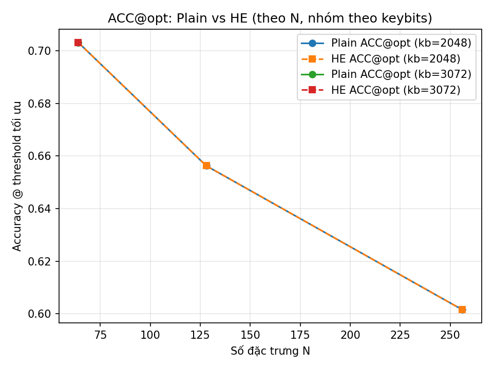
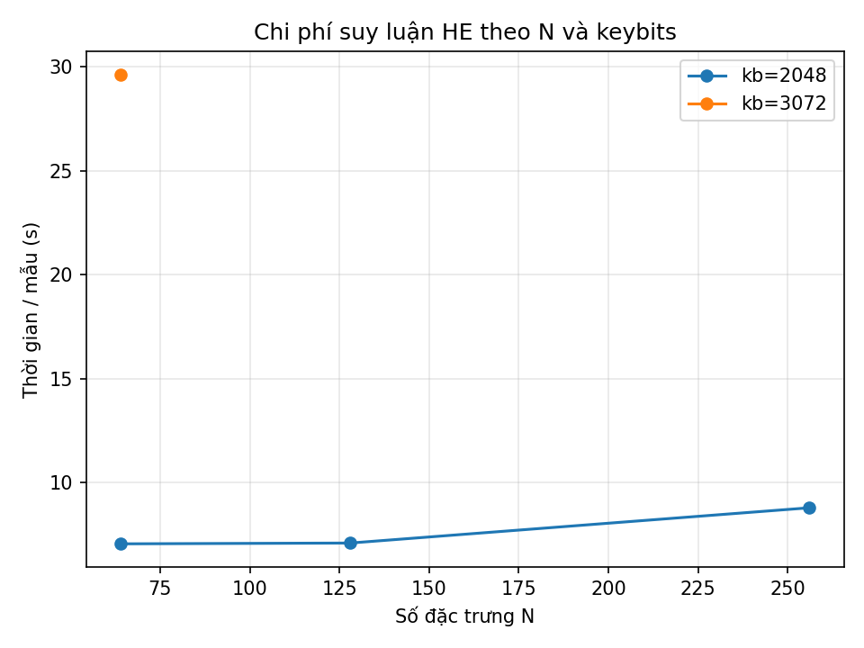

# 🔐 Privacy‑Preserving P300 BCI Inference with Paillier HE

> **One‑line summary.** This repo shows how to train a simple yet strong P300 EEG classifier and run **privacy‑preserving inference** using **Paillier Homomorphic Encryption (HE)**. We reproduce plaintext performance under encryption and report end‑to‑end latency per sample.

---

## 🧠 Dataset

- **Name:** BigP3BCI – *An Open, Diverse, and Machine‑Learning‑Ready P300‑based BCI Dataset*  
- **Host:** PhysioNet  
- **URL:** https://physionet.org/content/bigp3bci/1.0.0/  
- **What we use:** Subject A_01 / Session `SE001` (both Train/ Test; CB and RD tasks). The code works for other sessions in the same layout.

**EEG preprocessing (per file):**
- Resample (if needed) to **256 Hz**.
- Notch filter **50 Hz**, band‑pass **0.1–15 Hz**.
- Build events from `StimulusBegin` + `StimulusType` or annotations.
- Create epochs `t = [-0.2, 0.8] s`, baseline in `[-0.2, 0] s`.
- Keep EEG channels; assign 10‑20 montage (ignore missing locations).

---

## 📦 Environment

Create a Python 3.12 environment and install requirements:

```bash
python -m venv .venv && source .venv/bin/activate  # (Linux/Mac)
# or: python -m venv .venv; .venv\Scripts\activate  # (Windows PowerShell)

pip install -r requirements.txt
```

**`requirements.txt` (provided):**
```
numpy
pandas
scikit-learn
mne
joblib
matplotlib
tqdm
phe            # Paillier (python-paillier / phe)
```

> If you use our Docker/container image you can skip the steps above.

---

## 📁 Project layout

```
project/
├─ inputs/                      # feature files created from EEG
│  ├─ SE001_timewin64/         # time-window features (X, y in .npz)
│  └─ SE001_xdawn/             # xDAWN features (X, y in .npz)
├─ runs/                       # trained models + scalers + configs
│  ├─ timewin64_cv/
│  └─ xdawn_cv/
├─ artifacts/                  # reports, figures and CSV logs
│  ├─ summary_all.csv          # consolidated numeric results
│  ├─ summary_all.md           # table (markdown) of results
│  ├─ results_log_artifacts.csv
│  ├─ results_tuned.csv
│  ├─ best_config.json
│  ├─ model_best.joblib        # best sklearn pipeline (often LDA)
│  ├─ scaler_best.joblib       # companion scaler (if any)
│  ├─ acc_vs_n_by_keybits.png
│  ├─ auc_vs_n_by_keybits.png
│  └─ time_per_sample_by_n_and_keybits.png
├─ make_xdawn_features.py      # build xDAWN features
├─ save_features64.py          # build time-window features
├─ train_eval_models.py        # CV model selection (LR/SVC/KNN/DT/LDA)
├─ he_infer_paillier_artifacts.py  # Paillier-HE inference runner
├─ demo_infer.py               # timing & score-matching demo (HE vs plain)
├─ plot_result.py              # generate the summary plots
├─ run_he_suite.sh             # one-click pipeline (optional)
└─ README.md
```

---

## 🚀 Reproduce our pipeline

> **Assumption:** your EEG lives at `/work/bigP3BCI-data/StudyA/A_01/SE001` with subfolders `Train/CB/…edf`, `Train/RD/…edf`, `Test/CB/…edf`, `Test/RD/…edf` (this is the PhysioNet layout).

### 1) Extract features

**A. Time‑window mean (64 windows × channels)**

```bash
python save_features64.py \
  --session "/work/bigP3BCI-data/StudyA/A_01/SE001" \
  --outdir  inputs/SE001_timewin64
```

- **Input:** raw EDF files under `.../SE001/Train/*/*.edf` and `.../SE001/Test/*/*.edf`
- **Output:** `inputs/SE001_timewin64/train_features.npz`, `.../test_features.npz`
  - Each `.npz` contains `X` (n_samples × n_features) and `y` (0/1).

**B. xDAWN spatial filtering (3 comps × temporal windows)**

```bash
python make_xdawn_features.py \
  --session "/work/bigP3BCI-data/StudyA/A_01/SE001" \
  --outdir inputs/SE001_xdawn \
  --ncomp 3 --t0 0.0 --t1 0.6 --win 0.15 --step 0.15 \
  --decim 2 --max-files-train 2 --max-files-test 2 \
  --max-epochs-train 4000 --max-epochs-test 4000
```

- **Output:** `inputs/SE001_xdawn/train_features.npz`, `.../test_features.npz`

### 2) Train & select the best model (CV on Train → evaluate on Test)

Time‑window features:
```bash
python train_eval_models.py --indir inputs/SE001_timewin64 --outdir runs/timewin64_cv
```
xDAWN features:
```bash
python train_eval_models.py --indir inputs/SE001_xdawn --outdir runs/xdawn_cv
```

- **Output:** in each `runs/<name>_cv/`:
  - `model_best.joblib` (typically **LDA**)  
  - `scaler_best.joblib` (if the pipeline includes a scaler)  
  - `best_config.json` (CV info)  
  - A classification report printed to console.

### 3) Homomorphic inference with Paillier

Run the HE pipeline on saved features using the selected model:

```bash
python he_infer_paillier_artifacts.py \
  --featuresdir inputs/SE001_timewin64 \
  --modeldir   runs/timewin64_cv \
  --n 128 --keybits 2048
```

- **What it does**
  1. Loads `model_best.joblib` and extracts the **linear** decision function (LDA / LR).
  2. Encrypts feature vectors with Paillier (key size = `--keybits`).
  3. Computes the linear score **under encryption** (additions + scalar multiplies).
  4. Decrypts scores and compares **AUC/ACC** to plaintext.
- **Output logs** are appended to `artifacts/results_log_artifacts.csv` and the consolidated tables below.

### 4) Demo: timing and score equivalence (plain vs HE)

```bash
# Time-window model (K samples for timing)
python demo_infer.py \
  --featuresdir inputs/SE001_timewin64 \
  --modeldir   runs/timewin64_cv \
  --K 64 --keybits 2048

# xDAWN model
python demo_infer.py \
  --featuresdir inputs/SE001_xdawn \
  --modeldir   runs/xdawn_cv \
  --K 64 --keybits 2048
```

- Prints plaintext `predict_proba` timing vs Paillier‑HE timing per sample.
- Verifies that **HE linear scores ≈ plaintext** (`MAE` is ~0).

### 5) Plots & consolidated tables

```bash
python plot_result.py
```

This reads `artifacts/summary_all.csv` and writes:

- `artifacts/acc_vs_n_by_keybits.png`
- `artifacts/auc_vs_n_by_keybits.png`
- `artifacts/time_per_sample_by_n_and_keybits.png`
- (Re)generates `artifacts/summary_all.md`

> You can also run `./run_he_suite.sh` to execute a curated subset and regenerate the CSV/MD automatically.

---

## 📊 Results (as reproduced in this repo)

### A) Consolidated HE vs plaintext (from `artifacts/summary_all.md`)

| Model | N | Keybits | AUC_plain | ACC_plain@opt | AUC_HE | ACC_HE@opt | Time/sample (s) |
|:--|--:|--:|--:|--:|--:|--:|--:|
| LDA | 64  | 2048 | 0.7410 | 0.7031 | 0.7410 | 0.7031 | 7.043 |
| LDA | 64  | 3072 | 0.7410 | 0.7031 | 0.7410 | 0.7031 | 29.632 |
| LDA | 128 | 2048 | 0.6667 | 0.6562 | 0.6667 | 0.6562 | 7.082 |
| LDA | 256 | 2048 | 0.6003 | 0.6016 | 0.6003 | 0.6016 | 8.778 |

**Takeaways**
- HE **matches plaintext** AUC/ACC (as expected for linear models).
- Latency grows with Paillier key size (2048 → 3072) and with feature dimension.

### B) xDAWN LDA – demo timings (from console logs)

| Keybits | AUC_plain | ACC_plain@opt | AUC_HE | ACC_HE@opt | Time/sample (s) |
|:--:|:--:|:--:|:--:|:--:|--:|
| 1024 | 1.0000 | 1.0000 | 1.0000 | 1.0000 | ~0.402 |
| 2048 | 1.0000 | 1.0000 | 1.0000 | 1.0000 | ~2.802 |
| 3072 | 1.0000 | 1.0000 | 1.0000 | 1.0000 | ~9.054 |

> These values come from `demo_infer.py`/`he_infer_paillier_artifacts.py` runs on `inputs/SE001_xdawn` with `runs/xdawn_cv` (best model: LDA).

### C) Visualizations

<p align="center">
  
  
</p>
<p align="center">
  
</p>

---

## 🛡️ Privacy & threat model

- **Goal:** the server who runs the inference must **not** learn the user’s EEG features.  
- **Approach:** encrypt the feature vector with Paillier (client‑side), send ciphertexts; the server computes the **linear score** under encryption and returns an encrypted result; the client decrypts and thresholds locally.  
- **Model class:** we stick to **linear** decision functions (LDA/LogReg) which are Paillier‑friendly (additive HE).  
- **What HE *doesn’t* hide:** model weights (they live server‑side). Protect them with access control if needed.

---

## 🔎 Reproducibility checklist

- **Feature reproducibility:** `inputs/*/train_features.npz` and `test_features.npz` are deterministic given the session and parameters printed by the scripts (`--ncomp`, `--t0`, `--t1`, `--win`, `--step`, `--decim`).  
- **Model reproducibility:** CV uses fixed `random_state=42`. Best pipeline and scaler are saved as Joblib files.  
- **HE reproducibility:** we fix RNG seeds where applicable; `results_log_artifacts.csv` records every HE run (N, keybits, timing).  
- **Sanity checks:** `demo_infer.py` prints MAE between plaintext scores and HE scores to detect any mismatch.

---

## 🧩 Script reference (inputs → outputs)

| Script | What it does | Inputs | Outputs |
|---|---|---|---|
| `save_features64.py` | Time‑window features from EDF | `.../SE001/{Train,Test}/*/*.edf` | `inputs/SE001_timewin64/{train,test}_features.npz` |
| `make_xdawn_features.py` | xDAWN features (n components, temporal windows) | same EDF | `inputs/SE001_xdawn/{train,test}_features.npz` |
| `train_eval_models.py` | CV over LR/SVC/KNN/DT/LDA → pick best by AUC | `inputs/*/*.npz` | `runs/*/model_best.joblib`, `scaler_best.joblib`, `best_config.json`, `results_tuned.csv` |
| `he_infer_paillier_artifacts.py` | Run Paillier HE inference and log metrics | features dir + model dir | appends to `artifacts/results_log_artifacts.csv`; updates consolidated summaries |
| `demo_infer.py` | Compare timings and score matching (plain vs HE) | features dir + model dir | console timing, MAE |
| `plot_result.py` | Build plots from consolidated CSV | `artifacts/summary_all.csv` | the three PNG figures + `summary_all.md` |
| `run_he_suite.sh` | Example end‑to‑end run | scripts above | refreshes artifacts |

---

## 🧪 Minimal quick test (5 commands)

```bash
# 1) Build time-window features
python save_features64.py --session "/work/bigP3BCI-data/StudyA/A_01/SE001" --outdir inputs/SE001_timewin64

# 2) Train & select model
python train_eval_models.py --indir inputs/SE001_timewin64 --outdir runs/timewin64_cv

# 3) Run HE inference (Paillier 2048‑bit)
python he_infer_paillier_artifacts.py --featuresdir inputs/SE001_timewin64 --modeldir runs/timewin64_cv --n 128 --keybits 2048

# 4) Make plots & consolidated table
python plot_result.py

# 5) Optional: xDAWN pipeline
python make_xdawn_features.py --session "/work/bigP3BCI-data/StudyA/A_01/SE001" --outdir inputs/SE001_xdawn --ncomp 3
python train_eval_models.py --indir inputs/SE001_xdawn --outdir runs/xdawn_cv
python demo_infer.py --featuresdir inputs/SE001_xdawn --modeldir runs/xdawn_cv --K 64 --keybits 2048
```

---

## 📌 Notes & limitations

- Paillier is **additively** homomorphic → perfect for linear models (LDA/LogReg). For non‑linear models, use polynomial approximations or other HE schemes (CKKS/BFV) or TEEs.  
- HE latency is **orders of magnitude** slower than plaintext; use **feature reduction** (xDAWN / fewer windows) to keep runtime practical.  
- Key sizes: 2048‑bit is a good balance for the demo; 3072‑bit increases latency substantially.

---

## 📣 Citation

If you use the dataset, please cite the **BigP3BCI** PhysioNet resource as instructed on its page. If you use this repo, please star the project and cite this work-in-progress demo.

---

**Happy (and private) BCI!** 🧪🔒
